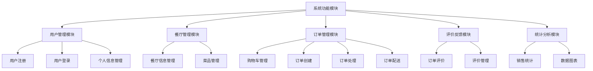
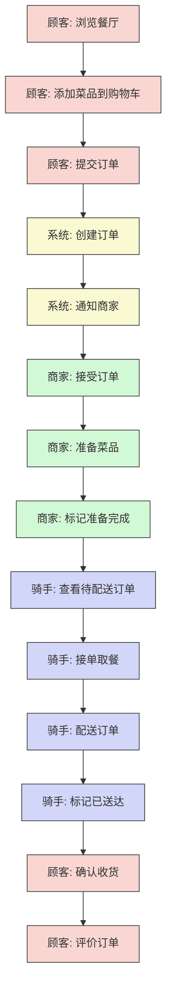
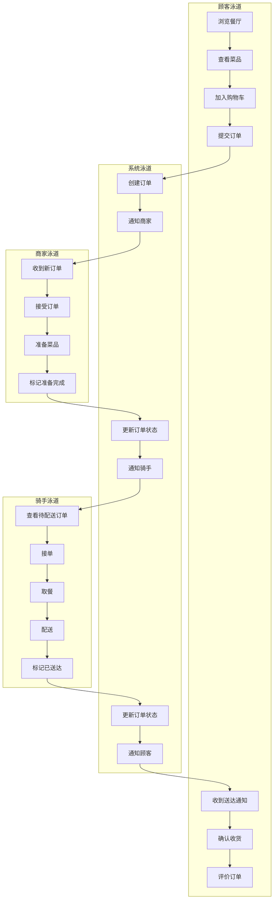
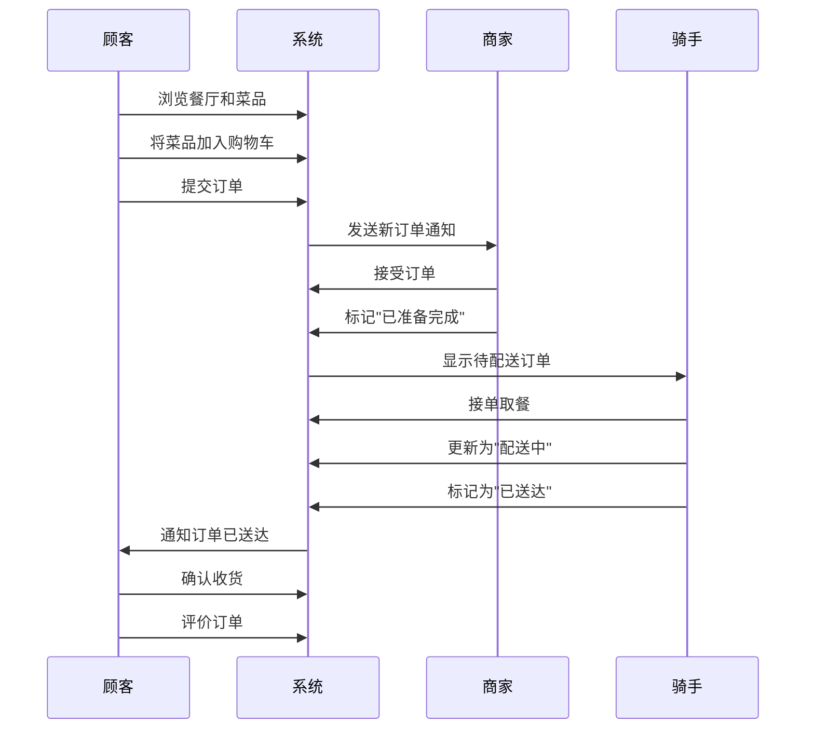
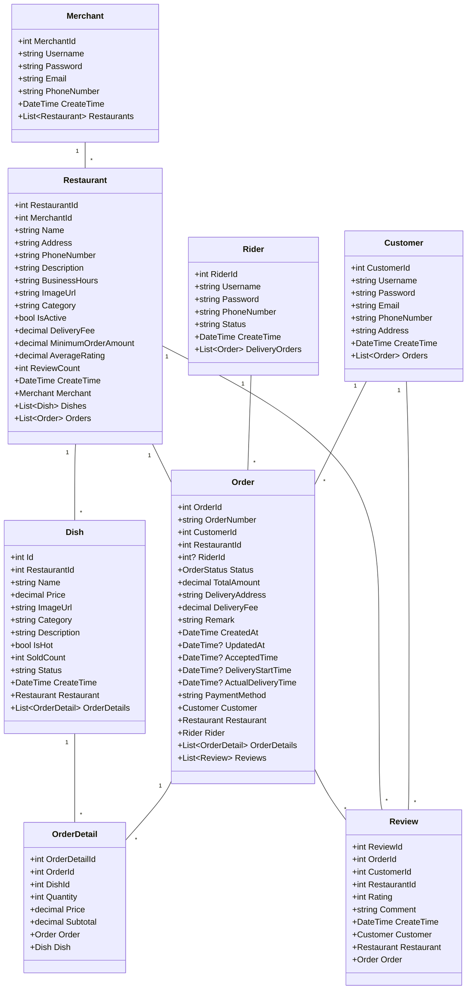
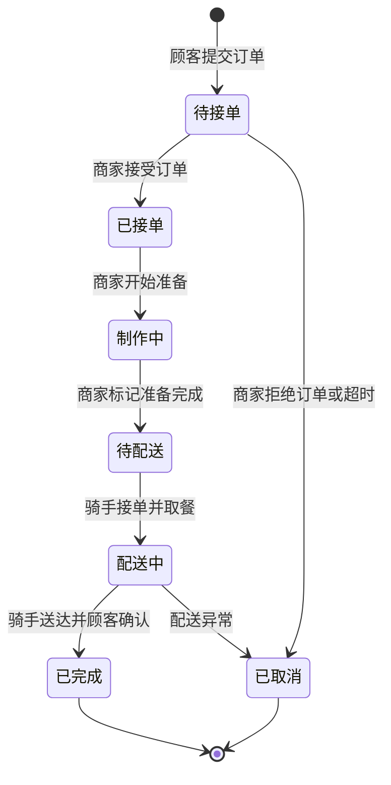

## 一、需求分析

随着互联网技术的发展和人们生活节奏的加快，外卖服务已成为现代生活的重要组成部分。本课题旨在设计和实现一个基于.NET框架的外卖订餐系统，该系统需要满足顾客、商家和骑手三类用户的不同需求。

### 1.1 功能需求

#### 1.1.1 顾客端功能

1. 用户注册与登录：顾客可以注册账号并登录系统。
2. 餐厅浏览：顾客可以浏览系统中的餐厅列表，查看餐厅详情。
3. 菜品浏览与选择：顾客可以查看餐厅的菜品，将喜欢的菜品加入购物车。
4. 订单管理：顾客可以创建订单、查看订单状态、取消未处理的订单。
5. 评价系统：顾客可以对已完成的订单进行评价和打分。

#### 1.1.2 商家端功能

1. 商家注册与登录：餐厅商家可以注册账号并登录系统。
2. 餐厅信息管理：商家可以创建和管理自己的餐厅信息。
3. 菜品管理：商家可以添加、编辑、删除菜品信息，包括名称、价格、图片等。
4. 订单处理：商家可以查看新订单，接受或拒绝订单，更新订单状态。
5. 销售统计：商家可以查看销售数据，如销售额、热门菜品等。

#### 1.1.3 骑手端功能

1. 骑手注册与登录：配送骑手可以注册账号并登录系统。
2. 接单功能：骑手可以查看待配送订单，选择接单。
3. 订单配送：骑手可以更新订单配送状态，标记订单为已送达。
4. 配送历史：骑手可以查看自己的配送历史和评价。

### 1.2 非功能需求

1. 安全性：系统需要确保用户数据的安全，防止未授权访问。
2. 可用性：系统界面应简洁明了，操作流程应直观易懂。
3. 性能：系统响应时间应在可接受范围内，数据库查询应高效。
4. 可维护性：代码应结构清晰，有良好的注释，便于后期维护。

## 二、总体设计

### 2.1 系统架构设计

本系统采用ASP.NET MVC架构进行开发，遵循MVC（Model-View-Controller）设计模式，实现了业务逻辑与用户界面的分离。系统主要分为以下几个部分：

1. **模型层（Model）**：负责数据访问和业务逻辑，包含实体类和数据库上下文类。
2. **视图层（View）**：负责用户界面的展示，采用Razor语法编写。
3. **控制器层（Controller）**：负责处理用户请求，调用模型层处理数据，选择合适的视图进行响应。

系统还采用了Entity Framework作为ORM框架，实现了对数据库的高效访问和管理。

### 2.2 功能模块设计

系统主要包括以下功能模块：

#### 2.2.1 用户管理模块

1. 用户注册：实现不同角色（顾客、商家、骑手）的用户注册功能。
2. 用户登录：实现用户身份验证，根据用户角色导向不同的功能界面。
3. 个人信息管理：用户可以查看和修改个人信息。

#### 2.2.2 餐厅管理模块

1. 餐厅信息管理：商家可以创建和编辑餐厅信息，包括名称、地址、联系方式等。
2. 菜品管理：商家可以添加、编辑、删除菜品，设置菜品价格、类别和图片。

#### 2.2.3 订单管理模块

1. 购物车管理：顾客可以将菜品加入购物车，调整数量，查看购物车内容。
2. 订单创建：顾客可以从购物车创建订单，选择配送地址和支付方式。
3. 订单处理：商家可以查看新订单，接受或拒绝，更新订单状态。
4. 订单配送：骑手可以接受配送任务，更新配送状态。

#### 2.2.4 评价反馈模块

1. 订单评价：顾客可以对已完成的订单进行评分和评论。
2. 评价管理：商家可以查看顾客评价，了解服务质量。

#### 2.2.5 统计分析模块

1. 销售统计：商家可以查看销售数据，如销售额、订单量等。
2. 数据图表：通过图表直观展示销售趋势和热门菜品。

#### 2.2.6 系统功能模块图

下图展示了系统的主要功能模块及其子模块的结构：



### 2.3 数据流程设计

以下是系统主要业务流程的设计：

#### 2.3.1 订单创建流程

1. 顾客浏览餐厅和菜品
2. 顾客将菜品加入购物车
3. 顾客确认订单信息，提交订单
4. 系统创建订单，等待商家接单

#### 2.3.2 订单处理流程

1. 商家收到新订单通知
2. 商家接受或拒绝订单
3. 如接受，商家开始准备菜品
4. 商家标记订单为"已准备完成"，等待骑手取餐
5. 骑手接单并取餐
6. 骑手送达并更新订单状态
7. 顾客确认收货，完成订单

#### 2.3.3 订单流程图

下图展示了订单从创建到完成的详细流程，不同颜色代表不同角色的操作：



#### 2.3.4 订单处理泳道图

下图通过泳道图展示了顾客、系统、商家和骑手之间的交互流程，清晰地划分了各角色的职责范围：



#### 2.3.5 订单处理时序图

下图展示了订单从创建到完成的完整流程和各角色之间的交互：



## 三、数据库设计

### 3.1 数据库表设计

#### 3.1.1 用户相关表

**Customer表（顾客）**

| 字段名      | 数据类型      | 描述         |
| ----------- | ------------- | ------------ |
| CustomerId  | int           | 主键，顾客ID |
| Username    | nvarchar(50)  | 用户名       |
| Password    | nvarchar(100) | 密码         |
| Email       | nvarchar(100) | 电子邮箱     |
| PhoneNumber | nvarchar(20)  | 手机号码     |
| Address     | nvarchar(200) | 地址         |
| CreateTime  | datetime      | 创建时间     |

**Merchant表（商家）**

| 字段名      | 数据类型      | 描述         |
| ----------- | ------------- | ------------ |
| MerchantId  | int           | 主键，商家ID |
| Username    | nvarchar(50)  | 用户名       |
| Password    | nvarchar(100) | 密码         |
| Email       | nvarchar(100) | 电子邮箱     |
| PhoneNumber | nvarchar(20)  | 联系电话     |
| CreateTime  | datetime      | 创建时间     |

**Rider表（骑手）**

| 字段名      | 数据类型      | 描述                 |
| ----------- | ------------- | -------------------- |
| RiderId     | int           | 主键，骑手ID         |
| Username    | nvarchar(50)  | 用户名               |
| Password    | nvarchar(100) | 密码                 |
| PhoneNumber | nvarchar(20)  | 联系电话             |
| Status      | nvarchar(20)  | 状态（在线、离线等） |
| CreateTime  | datetime      | 创建时间             |

#### 3.1.2 餐厅和菜品表

**Restaurant表（餐厅）**

| 字段名             | 数据类型       | 描述             |
| ------------------ | -------------- | ---------------- |
| RestaurantId       | int            | 主键，餐厅ID     |
| MerchantId         | int            | 外键，关联商家ID |
| Name               | nvarchar(100)  | 餐厅名称         |
| Address            | nvarchar(200)  | 餐厅地址         |
| PhoneNumber        | nvarchar(20)   | 联系电话         |
| Description        | nvarchar(1000) | 餐厅描述         |
| BusinessHours      | nvarchar(100)  | 营业时间         |
| ImageUrl           | nvarchar(200)  | 餐厅图片         |
| Category           | nvarchar(100)  | 餐厅分类         |
| IsActive           | bit            | 是否营业         |
| DeliveryFee        | decimal(18,2)  | 配送费           |
| MinimumOrderAmount | decimal(18,2)  | 最低订单金额     |
| AverageRating      | decimal(18,2)  | 平均评分         |
| ReviewCount        | int            | 评价数量         |
| CreateTime         | datetime       | 创建时间         |

**Dish表（菜品）**

| 字段名       | 数据类型      | 描述                 |
| ------------ | ------------- | -------------------- |
| Id           | int           | 主键，菜品ID         |
| RestaurantId | int           | 外键，关联餐厅ID     |
| Name         | nvarchar(50)  | 菜品名称             |
| Price        | decimal(18,2) | 价格                 |
| ImageUrl     | nvarchar(255) | 菜品图片             |
| Category     | nvarchar(50)  | 菜品分类             |
| Description  | nvarchar(200) | 菜品描述             |
| IsHot        | bit           | 是否热销             |
| SoldCount    | int           | 今日售出数量         |
| Status       | nvarchar(20)  | 状态（上架、下架等） |
| CreateTime   | datetime      | 创建时间             |

#### 3.1.3 订单相关表

**Order表（订单）**

| 字段名             | 数据类型      | 描述                                                         |
| ------------------ | ------------- | ------------------------------------------------------------ |
| OrderId            | int           | 主键，订单ID                                                 |
| OrderNumber        | nvarchar(50)  | 订单编号                                                     |
| CustomerId         | int           | 外键，关联顾客ID                                             |
| RestaurantId       | int           | 外键，关联餐厅ID                                             |
| RiderId            | int           | 外键，关联骑手ID                                             |
| Status             | int           | 订单状态（枚举：待接单、已接单、制作中、待配送、配送中、已完成、已取消） |
| TotalAmount        | decimal(18,2) | 订单总额                                                     |
| DeliveryAddress    | nvarchar(200) | 配送地址                                                     |
| DeliveryFee        | decimal(18,2) | 配送费                                                       |
| Remark             | nvarchar(500) | 订单备注                                                     |
| CreatedAt          | datetime      | 创建时间                                                     |
| UpdatedAt          | datetime      | 更新时间                                                     |
| AcceptedTime       | datetime      | 接单时间                                                     |
| DeliveryStartTime  | datetime      | 开始配送时间                                                 |
| ActualDeliveryTime | datetime      | 实际送达时间                                                 |
| PaymentMethod      | nvarchar(50)  | 支付方式                                                     |

**OrderDetail表（订单明细）**

| 字段名        | 数据类型      | 描述             |
| ------------- | ------------- | ---------------- |
| OrderDetailId | int           | 主键，明细ID     |
| OrderId       | int           | 外键，关联订单ID |
| DishId        | int           | 外键，关联菜品ID |
| Quantity      | int           | 数量             |
| Price         | decimal(18,2) | 单价             |
| Subtotal      | decimal(18,2) | 小计             |

### 3.2 实体关系图


实体之间的关系总结如下：

1. 一个商家可以拥有多个餐厅（一对多）
2. 一个餐厅可以提供多个菜品（一对多）
3. 一个顾客可以有多个订单（一对多）
4. 一个餐厅可以有多个订单（一对多）
5. 一个骑手可以配送多个订单（一对多）
6. 一个订单可以包含多个订单明细（一对多）

系统通过Entity Framework的Code First方式定义这些关系，使用导航属性和外键约束确保数据的完整性和一致性。

### 3.3 类图设计

下面的类图展示了系统的主要实体类及其关系，包括各个类的属性和关联关系：



## 四、系统实现

### 4.1 用户界面实现

系统采用Bootstrap框架实现响应式布局，确保在不同设备上具有良好的显示效果和用户体验。以下是系统主要界面的运行截图展示：


#### 4.1.1 首页

系统首页清晰展示了系统的主要功能和用户角色，提供了登录、注册和浏览餐厅的快速入口。页面采用现代化设计风格，视觉效果良好。


系统首页包含以下主要部分：

1. 主页区：展示系统名称和简介，提供快速登录和注册按钮
2. 功能介绍区：展示系统的基础功能，如增删改查、关联表、注册登录等
3. 用户角色区：展示顾客、商家和骑手三种角色的主要功能

#### 4.1.2 餐厅列表页

餐厅列表页面以卡片形式展示所有餐厅，包含餐厅名称、图片、评分等信息。用户可以通过分类筛选和搜索功能找到所需餐厅。


#### 4.1.3 菜品管理页

商家可以通过菜品管理页面添加、编辑和删除菜品。页面包含菜品列表和菜品详情编辑表单，支持图片上传和预览功能。


#### 4.1.4 订单管理页

订单管理页面根据用户角色展示不同内容：

1. 顾客可以查看自己的订单历史和状态

   


2、商家可以处理待接单和进行中的订单


导出PDF


3、骑手可以查看待配送和配送历史的订单


#### **4.1.4 商家仪表盘页**

商家可以查看自己的营收数据


### 4.2 关键功能实现

#### 4.2.6 用户注册与登录界面

用户可以根据自己的角色选择注册为顾客、商家或骑手，系统会分别引导到不同的功能界面。

1、登录


2、注册


#### 4.2.1 用户认证实现

系统通过Session存储用户登录状态和用户类型，使用自定义认证过滤器（如AdminOnlyAttribute、CustomerOnlyAttribute）控制对不同功能的访问权限。

用户认证控制器（AccountController）实现了用户注册、登录和注销功能，代码示例如下：

```csharp
[HttpPost]
[ValidateAntiForgeryToken]
public ActionResult Login(LoginViewModel model)
{
    if (ModelState.IsValid)
    {
        // 根据用户类型查找用户
        if (model.UserType == UserTypes.Customer)
        {
            var customer = db.Customers.FirstOrDefault(c => c.Username == model.Username && c.Password == model.Password);
            if (customer != null)
            {
                // 设置Session
                Session["UserId"] = customer.CustomerId;
                Session["Username"] = customer.Username;
                Session["UserType"] = UserTypes.Customer;
                return RedirectToAction("Index", "Home");
            }
        }
        else if (model.UserType == UserTypes.Merchant)
        {
            var merchant = db.Merchants.FirstOrDefault(m => m.Username == model.Username && m.Password == model.Password);
            if (merchant != null)
            {
                Session["UserId"] = merchant.MerchantId;
                Session["Username"] = merchant.Username;
                Session["UserType"] = UserTypes.Merchant;
                return RedirectToAction("Dashboard", "Merchant");
            }
        }
        else if (model.UserType == UserTypes.Rider)
        {
            var rider = db.Riders.FirstOrDefault(r => r.Username == model.Username && r.Password == model.Password);
            if (rider != null)
            {
                Session["UserId"] = rider.RiderId;
                Session["Username"] = rider.Username;
                Session["UserType"] = UserTypes.Rider;
                return RedirectToAction("Index", "Rider");
            }
        }
    
        ModelState.AddModelError("", "用户名或密码不正确");
    }
  
    return View(model);
}
```

#### 4.2.2 订单流程实现

订单流程是系统的核心功能，涉及顾客下单、商家接单、骑手配送等多个环节。系统通过OrderStatus枚举类型定义订单状态，实现订单状态的流转：

```csharp
public enum OrderStatus
{
    [Display(Name = "待接单")]
    Pending,
    [Display(Name = "已接单")]
    Accepted,
    [Display(Name = "制作中")]
    Preparing,
    [Display(Name = "待配送")]
    ReadyForDelivery,
    [Display(Name = "配送中")]
    InDelivery,
    [Display(Name = "已完成")]
    Delivered,
    [Display(Name = "已取消")]
    Cancelled
}
```

顾客下单的核心代码如下：

```csharp
[HttpPost]
[ValidateAntiForgeryToken]
public ActionResult PlaceOrder(int restaurantId, FormCollection form)
{
    if (Session["CustomerId"] == null)
    {
        return RedirectToAction("Login", "Account");
    }
  
    int customerId = Convert.ToInt32(Session["CustomerId"]);
    var customer = db.Customers.Find(customerId);
    var restaurant = db.Restaurants.Find(restaurantId);
  
    // 创建订单
    var order = new Order
    {
        CustomerId = customerId,
        RestaurantId = restaurantId,
        Status = OrderStatus.Pending,
        OrderNumber = GenerateOrderNumber(),
        DeliveryAddress = customer.Address,
        CreatedAt = DateTime.Now,
        DeliveryFee = restaurant.DeliveryFee,
        OrderDetails = new List<OrderDetail>()
    };
  
    decimal totalAmount = 0;
    foreach (var key in form.AllKeys)
    {
        if (key.StartsWith("quantity_"))
        {
            int dishId = int.Parse(key.Substring(9));
            int quantity = int.Parse(form[key]);
        
            if (quantity > 0)
            {
                var dish = db.Dishes.Find(dishId);
            
                var orderDetail = new OrderDetail
                {
                    DishId = dishId,
                    Quantity = quantity,
                    Price = dish.Price,
                    Subtotal = dish.Price * quantity
                };
            
                order.OrderDetails.Add(orderDetail);
                totalAmount += orderDetail.Subtotal;
            }
        }
    }
  
    order.TotalAmount = totalAmount + order.DeliveryFee;
  
    db.Orders.Add(order);
    db.SaveChanges();
  
    return RedirectToAction("MyOrders");
}
```

商家接单的核心代码如下：

```csharp
[HttpPost]
[ValidateAntiForgeryToken]
public ActionResult AcceptOrder(int id)
{
    // 检查用户是否登录且是商家
    if (Session["UserId"] == null || (string)Session["UserType"] != UserTypes.Merchant)
    {
        return RedirectToAction("Login", "Account");
    }
  
    var order = db.Orders.Find(id);
    if (order == null)
    {
        return HttpNotFound();
    }
  
    // 验证商家是否拥有该餐厅
    int merchantId = Convert.ToInt32(Session["UserId"]);
    var restaurant = db.Restaurants.Find(order.RestaurantId);
    if (restaurant.MerchantId != merchantId)
    {
        return new HttpStatusCodeResult(HttpStatusCode.Forbidden);
    }
  
    // 只能接受待接单状态的订单
    if (order.Status != OrderStatus.Pending)
    {
        return new HttpStatusCodeResult(HttpStatusCode.BadRequest);
    }
  
    // 更新订单状态为已接单
    order.Status = OrderStatus.Accepted;
    order.AcceptedTime = DateTime.Now;
    order.UpdatedAt = DateTime.Now;
  
    db.SaveChanges();
  
    return RedirectToAction("MerchantOrders");
}
```

骑手接单配送的核心代码如下：

```csharp
[HttpPost]
[ValidateAntiForgeryToken]
public ActionResult TakeOrder(int id)
{
    // 检查用户是否登录且是骑手
    if (Session["UserId"] == null || (string)Session["UserType"] != UserTypes.Rider)
    {
        return RedirectToAction("Login", "Account");
    }
  
    int riderId = Convert.ToInt32(Session["UserId"]);
  
    var order = db.Orders.Find(id);
    if (order == null)
    {
        return HttpNotFound();
    }
  
    // 只能接待配送状态的订单
    if (order.Status != OrderStatus.ReadyForDelivery)
    {
        return new HttpStatusCodeResult(HttpStatusCode.BadRequest);
    }
  
    // 更新订单状态为配送中
    order.Status = OrderStatus.InDelivery;
    order.RiderId = riderId;
    order.DeliveryStartTime = DateTime.Now;
    order.UpdatedAt = DateTime.Now;
  
    db.SaveChanges();
  
    return RedirectToAction("RiderOrders");
}
```

#### 4.2.3 订单状态流转图

下图展示了订单在系统中的各种状态及其转换关系：



#### 4.2.4 文件上传实现

系统实现了菜品和餐厅图片的上传功能，使用自定义的FileUploadHelper类处理文件上传逻辑：

```csharp
public static string UploadDishImage(HttpPostedFileBase file)
{
    if (file == null || file.ContentLength == 0)
        return null;
    
    // 生成唯一文件名
    string fileName = Guid.NewGuid().ToString() + Path.GetExtension(file.FileName);
  
    // 确保目录存在
    string uploadPath = Path.Combine(HttpContext.Current.Server.MapPath("~/Content/Images/Dishes/"), fileName);
  
    // 确保目录存在
    Directory.CreateDirectory(Path.GetDirectoryName(uploadPath));
  
    // 保存文件
    file.SaveAs(uploadPath);
  
    // 返回相对路径
    return "/Content/Images/Dishes/" + fileName;
}
```

#### 4.2.5 销售统计实现

系统使用ECharts实现了销售数据的可视化展示，商家可以查看不同时间段的销售情况和热门菜品。

```csharp
public ActionResult GetSalesData(string period = "week")
{
    int merchantId = Convert.ToInt32(Session["UserId"]);
  
    // 获取商家所拥有的所有餐厅
    var restaurantIds = db.Restaurants
        .Where(r => r.MerchantId == merchantId)
        .Select(r => r.RestaurantId)
        .ToList();
  
    // 根据时间段筛选订单
    var query = db.Orders
        .Where(o => restaurantIds.Contains(o.RestaurantId) && o.Status == OrderStatus.Delivered);
  
    DateTime startDate = DateTime.Today;
    switch (period.ToLower())
    {
        case "week":
            startDate = DateTime.Today.AddDays(-7);
            break;
        case "month":
            startDate = DateTime.Today.AddMonths(-1);
            break;
        case "year":
            startDate = DateTime.Today.AddYears(-1);
            break;
    }
  
    var orders = query.Where(o => o.CreatedAt >= startDate).ToList();
  
    // 按日期分组统计
    var salesData = orders
        .GroupBy(o => o.CreatedAt.Date)
        .Select(g => new ChartDataItem
        {
            name = g.Key.ToString("MM-dd"),
            value = (int)g.Sum(o => o.TotalAmount)
        })
        .ToList();
  
    return Json(salesData, JsonRequestBehavior.AllowGet);
}
```


### 4.3 系统部署

系统采用以下技术进行开发和部署：

1. **开发环境**：Visual Studio 2022
2. **编程语言**：C#
3. **Web框架**：ASP.NET MVC 5
4. **ORM框架**：Entity Framework 6
5. **前端技术**：Bootstrap 5、jQuery、ECharts
6. **数据库**：Microsoft SQL Server
7. **部署平台**：IIS 10

## 五、结论与心得

### 5.1 项目总结

本次课程设计成功实现了一个功能完备的外卖订餐系统，具有以下特点：

1. **完整的业务流程**：系统涵盖了从用户注册、餐厅浏览、点餐、配送到评价的完整业务流程。
2. **多角色支持**：系统支持顾客、商家、骑手三种用户角色，每种角色都有相应的功能模块。
3. **良好的用户体验**：系统界面简洁明了，操作流程直观易懂，响应速度快。
4. **数据可视化**：使用ECharts实现销售数据的可视化展示，帮助商家了解销售情况。

### 5.2 遇到的问题与解决方法

在开发过程中，遇到了以下几个主要问题：

1. **数据库关系设计问题**：初始设计时，未考虑到订单状态变更的完整流程，导致后期需要修改数据库结构。解决方法是重新设计数据库关系，增加了OrderStatus枚举类型，明确了订单状态的转换流程。
2. **图片上传与存储问题**：菜品和餐厅图片的上传与存储遇到了权限和路径问题。解决方法是创建专门的图片上传辅助类，统一处理图片上传逻辑，并设置适当的文件权限。
3. **多角色认证与授权问题**：系统需要针对不同用户角色设置不同的访问权限。解决方法是创建自定义的授权过滤器（如AdminOnlyAttribute、CustomerOnlyAttribute），根据用户角色控制对控制器Action的访问权限。
4. **订单状态管理问题**：订单状态的变更需要考虑多种场景和条件。解决方法是设计合理的状态转换逻辑，并在控制器中实现严格的状态检查和验证。

### 5.3 学习心得

通过本次课程设计，我深刻理解了软件工程的重要性，特别是在需求分析、系统设计和代码实现环节。编写高质量的代码不仅仅是实现功能，还需要考虑代码的可读性、可维护性和可扩展性。

在技术方面，我掌握了ASP.NET MVC框架的核心概念和使用方法，学会了使用Entity Framework进行数据库操作，理解了Web应用程序的开发流程和部署方法。

在项目管理方面，我认识到了合理规划时间、分解任务的重要性。一个复杂的系统需要分步骤开发和测试，确保每个功能模块的质量和稳定性。

### 5.4 未来改进方向

如果有更多的时间，我希望在以下几个方面对系统进行改进：

（一）**实时通知功能**：使用SignalR实现实时订单通知，提高用户体验。
（二）**移动端适配**：进一步优化系统在移动设备上的显示和操作体验。
（三）**支付功能集成**：集成第三方支付接口，实现在线支付功能。
（四）**配送路线优化**：引入地图API，为骑手提供最优配送路线建议。
（五）**数据分析功能增强**：增加更多的数据分析维度和可视化图表，帮助商家制定经营策略。

## 六、致谢

在此，我要感谢指导教师的悉心指导和同学们的帮助与支持。通过本次课程设计，我不仅提高了专业技能，也锻炼了独立思考和解决问题的能力。这些宝贵的经验将对我未来的学习和工作产生积极的影响。
